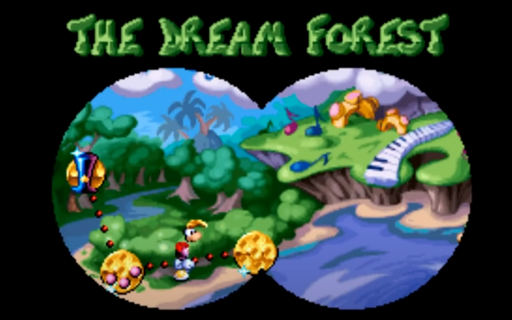
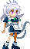

# 프로젝트 - 농그랑땡의 모험
 

# [ 목차 ]
### 1. [컨셉](#1)
### 2. [관련이미지](#2)
### 3. [대표이미지](#3)
### 4. [작품묘사](#4)
### 5. [구성요소](#5)
### 6. [게임 시스템 디자인](#6)
- [게임 오브젝트 분해](#61)
- [파라미터(속성)](#62)
- [행동](#63)
- [상태](#64)
- [플레이어 캐릭터 속성(파라미터)](#65)
- [게임의 규칙](#66)
- [게임에서 사용될 공식](#67)

### 7. [개발 요구사항 & 흐름도](#7)
- [요구사항(1년 / 6주)](#71)
- [키보드 이벤트에 대한 흐름도](#72)
- [용어 정리](#73)

### 8. [개발작업 일정(6주)](#8)

### 9. [주차별 작업결과](#9)
- 1주차 작업결과(#91)
- 2주차 작업결과(#92)
- 3주차 작업결과(#93)

   

# 컨셉 

## 메인컨셉 : 도전의식

- 플레이어에게 계속해서 도전하게 만들기 위한 여러 요소들을 추가하여 제작.
- 1인 플레이.

### 서브 컨셉 1 : 모험

- 순차적으로 스테이지를 클리어하여 진행하는 방식으로 제작 예정.
- 모험을 한다는 느낌을 주기 위해 다양한 스테이지 구성이 필요.

### 서브 컨셉 2 : 히든

- 게임진행에 있어 좀 더 편의성을 줄 수 있거나 엔딩에 영향을 주는 숨겨진 요소 도입.
- 시각적으로 사각지대인 부분에 장치하거나, 특정 기술 통해  혹은 조건을 만족했을 시 발견할 수 있도록 설계.

### 서브 컨셉 3 : 퍼즐

- 플레이어에게 많은 생각을 요구할 수 있도록 퍼즐 요소 추가.
- 공격횟수에 제한을 둔다거나, 상자를 특정위치에 옮긴다던가 하는 방식으로 구상중.

### 서브 컨셉 4 : 함정

- 장애물 혹은 특정 트리거를 발동했을 시 나타나는 함정 요소.
- 기본적으로 가시, 낭떠러지 같은 장애물 요소 도입.
- 스위치를 건드렸을 때 플레이어에게 데미지를 주는 방식을 구상중.

### 서브 컨셉 5 : 컨트롤

- 2D 플랫폼인 만큼 정교한 컨트롤을 할 수 있도록 설계 예정.
- 점프의 높낮이를 조절하거나 점프거리를 계산해야 하거나 적의 공격을 피해야하거나 등
- 기본적으로 조작은 간단하나 많은 시행착오를 겪어야만 진행 할 수 있도록 설계할 것.

  

# 관련 이미지 & 동영상 

- 이미지    
    
  슈퍼마리오
     
  

    
  레이맨
     

   
  동굴남
     

   
  슈퍼마리오월드
     

   
  I wanna be the Guy
     

- 동영상    
    
  에리의 액션
     

    
  고양이마리오
     

# [대표 이미지] 

  

# [컨셉 & 대표이미지 기반 작품묘사] 

PTT파일 링크  
https://docs.google.com/presentation/d/1X3M8j7UW1CF47n49GKHHoncGzzOpZUkN/edit?usp=sharing&ouid=106384652671129907928&rtpof=true&sd=true

  

# [농그랑땡의 모험 구성 요소] 

 

## 1. 메커니즘

[도전 과제]

1. 주어진 스테이지에서 클리어에 필요한 요소를 찾아라.
2. 장애물들을 잘 파악하고 피해서 진행하라.
3. 숨겨져있는 아이템이나, 루트를 탐색하라.

[재미 요소]

1. 다양한 함정들과 기믹으로 스테이지를 진행하는 재미가 있다.
2. 어려운 난이도의 스테이지를 클리어할 때마다 큰 성취감을 얻을 수 있다.
3. 다양한 스테이지로 플레이어에게 ‘모험을 하고있다’는 몰입감을 줄 수 있다.

[키조작]

 좌우 방향키: 캐릭터 이동  
 위방향키: 상호작용(NPC,객체 등)  
 아래방향키: 숙이기  
 Shift: 대쉬
 Spacebar: 점프  
 ESC: Pause, Menu 열기  
 A: 공격  
 Ctrl + S: 효과음 ON, OFF  
 Ctrl + M: 배경음 ON, OFF  

 

## 2. 이야기

[만들게 된 배경]  
평소부터 2D 플랫포머게임을 정말 좋아했고 굉장히 간단한 조작감인데도 불구하고 높은 수준의 몰입감과 성취감을 준다는 점이 매력적이라고 생각하여 만들자고 생각했습니다.

[참신함]  
예상치 못한 함정의 설계와 플레이어의 사각지대를 이용한 히든요소들.

[스토리]  
무엇이든 고쳐준다는 만병통치약으로 불리는 약초를 구하기 위해 모험을 떠나는 스토리. 
주인공은 여러 지역을 돌아다니며 사람들에게 정보를 수집하며 약초에 대한 단서를 얻는다. 
하지만 그의 여행길은 그렇게 호락호락하지 않았다…

 

## 3. 미적요소

[시각적 요소]  
1. 캐릭터 디자인: 2D 캐릭터로 디자인, 2~3등신의 캐릭터로 구상중.
1. 스테이지 디자인: 서브컨셉 ‘모험＇에 걸맞는 다양한 구조물로 스테이지 구현. ( 숲, 동굴, 설산, 절벽, 성 등등). 게임 컨트롤에 있어 직접 관여되는 Ground플랫폼을 기반으로 관여되지 않는 BackGround 이미지와 충돌이 적용되지 않는 구조체 등으로 구성.

1. 히든요소 디자인: 무언가 숨겨져 있음을 암시하는 표식을  맵디자인에 추가.Ex) 살짝 금이 가있는 벽, 주변환경과 어울리지 않는 색 등. 

1. 스코어 디자인: 우측 상단에 표시.

1. 아이템 디자인: 기본 점수를 주는 동전부터 시작하여 보석, 보물상자등 높은 점수를 줄 수록 화려하게 제작. 

[청각적 요소]  
1. BGM: 각각의 스테이지에 걸맞는 BGM을 설정.

1. 캐릭터 효과음: 캐릭터가 점프할 때, 함정에 닿을 때, 스테이지를 클리어 할 때, 아이템을 획득 했을 때 각각 적절한 효과음 추가.

1. 함정 효과음: 함정의 충돌이 ON될 때와 OFF될 때마다 적절한 효과음을 넣어 청각적으로도 함정을 파훼하는데 도움이 될 수 있도록 구현. Ex) 구멍에서 가시가 올라오는 트랩, 일정시간 마다 불을 내뿜는 트랩 등

 

## 4. 기술

PC용 싱글플레이 게임으로 Unity를 사용해 개발 예정.  
단순한 2D 플랫포머 게임이기때문에 웬만해선 사양을 크게 타지 않을 것으로 예상. 

  
# [게임시스템 디자인] 
  

# 1. 게임 오브젝트 분해 (구성 요소 분석) 

|연번|오브젝트 이름|오브젝트 이미지|
|:----:|:----:|:----:|
|1|플레이어||
|2|함정1||
|3|코인||
|4|무빙플랫폼||
|5|박스||
|6|스위치||
|7|문||
|8|함정2||
|9|체크포인트||
|10|목표지점1||
|11|목표지점2||
|12|몬스터|미정|

   
# 2. 파라미터(속성)  

### 1) 오브젝트 이름: 플레이어

|속성|영문명칭|설명|
|:----:|:----:|:----:|
|이동속도|moveS|캐릭터가 이동할 때의 속도.|
|점프력|jumpF|캐릭터가 점프할때의 힘.|
|대쉬속도|dashS|캐릭터가 대쉬할때의 속도.|
|최대점프횟수|maxJ|캐릭터의 연속점프 가능 횟수.|
|획득 점수|totalScore|게임 진행에 따른 점수.|
|시작위치|startP|게임을 시작하거나 플레이가 사망시 시작할 지점.|
|공격력|dmg|캐릭터의 공격력.|

 

### 2) 오브젝트 이름: 몬스터

|속성|영문명칭|설명|
|:----:|:----:|:----:|
|충돌|collision|객체와의 충돌 여부.|
|체력|HP|해당 오브젝트의 HP값.|
|이동속도|moveS|이동할 때의 속도.|
|딜레이|attack_delay|공격 시 다음 공격까지의 지연시간.|

 

### 3) 오브젝트 이름: 코인

|속성|영문명칭|설명|
|:----:|:----:|:----:|
|점수|score|캐릭터가 획득 시 부여할 점수의 크기.|

 

### 4) 오브젝트 이름: 무빙플랫폼

|속성|영문명칭|설명|
|:----:|:----:|:----:|
|이동속도|moveS|움직일때의 속도.|
|지점n|point1...|지형이 목표로 움직일 지점.|

 

### 5) 오브젝트 이름: 박스

|속성|영문명칭|설명|
|:----:|:----:|:----:|
|충돌|collision|객체와의 충돌 여부.|

 

### 6) 오브젝트 이름: 스위치

|속성|영문명칭|설명|
|:----:|:----:|:----:|
|충돌|collision|객체와의 충돌 여부.|
|작동|trigger|true일시 on, false일시 off.|

 

### 7) 오브젝트 이름: 문

|속성|영문명칭|설명|
|:----:|:----:|:----:|
|충돌|collision|객체와의 충돌 여부.|
|열림/닫힘|On/Off|true일시 open, false일시 close.|

 

### 8) 오브젝트 이름: 함정

|속성|영문명칭|설명|
|:----:|:----:|:----:|
|충돌|collision|객체와의 충돌 여부.|
|발동지점|On/Off|함정이 발동할 지점.|
|속도|trpaS|함정이 진행되는 속도.|

 

### 9) 오브젝트 이름: 체크포인트

|속성|영문명칭|설명|
|:----:|:----:|:----:|
|충돌|collision|객체와의 충돌 여부.|
|저장위치|checkPoint|캐릭터와 충돌 시 캐릭터의 시작위치에 해당값을 저장.|

 

### 10) 오브젝트 이름: 클리어지점

|속성|영문명칭|설명|
|:----:|:----:|:----:|
|충돌|collision|객체와의 충돌 여부.|

   
# 3. 행동 

### 1) 오브젝트 이름: 플레이어

|행동|설명|
|:----:|:----:|
|점프|점프키를 입력시 점프력만큼 y축으로 이동.|
|더블점프|점프상태에서 한번더 점프키를 입력시 발동.|
|이동|이동키를 입력시 moveF만큼 이동.|
|대쉬|대쉬키를 누른채 이동키를 입력시 dashF만큼 이동.|

 

### 2) 오브젝트 이름: 무빙 플랫폼

|행동|설명|
|:----:|:----:|
|순차이동|속성에 정해진 포인트지점을 순서대로 순회.|

 

### 3) 오브젝트 이름: 스위치

|행동|설명|
|:----:|:----:|
|On/Off|객체와 충돌시 상호작용하는 객체의 트리거를 발동, On/Off에 따라 모습이 변함.|

 

### 4) 오브젝트 이름: 문

|행동|설명|
|:----:|:----:|
|Open/Close|객체와 충돌시 상호작용하는 객체의 트리거를 발동, On/Off에 따라 모습이 변함.|

 

### 5) 오브젝트 이름: trap2(트리거함정)

|행동|설명|
|:----:|:----:|
|함정발동|속성에 정해진 area에 캐릭터가 닿을시 위에서 아래로 정해진 속도로 내려찍음.|

 

### 6) 오브젝트 이름: 체크포인트

|행동|설명|
|:----:|:----:|
|위치 저장|캐릭터와 충돌할 때 속성에 정해진 위치값을 캐릭터의 위치값에 저장.|

 

### 7) 오브젝트 이름: 코인

|행동|설명|
|:----:|:----:|
|점수 부여|속성에 정해진 score 값만큼 캐릭터의 totalScore값에 가중.|

 

### 8) 오브젝트 이름: 몬스터

|행동|설명|
|:----:|:----:|
|공격|속성에 정해진 delay 마다 공격.|
|피격|플레이어에게 데미지를 입었을 시 발동.|
|분노|일정 HP이하가 됐을 시 발동.|

   
# 4. 상태 

### 1) 오브젝트 이름: 플레이어

|현상태|전이상태|전이조건|
|:----:|:----:|:----:|
|통상|사망|사망트리거를 발동시키는 객체와의 충돌.|
|통상|낙하|플레이어와 ground에 충돌이 없을 시.|
|통상|대쉬|대쉬키를 입력했을 시.|

 

### 2) 오브젝트 이름: 몬스터

|현상태|전이상태|전이조건|
|:----:|:----:|:----:|
|통상|사망|HP=0이 될 시 사망.|
|통상|공격|attack_delay가 충족도리 경우.|
|통상|피격|플레이어에게 데미지를 입을 시.|
|통상|분노|특정 HP이하까지 도달 했을 시.|

   
# 5. 플레이어 캐릭터 속성(파라미터) 

|속성|영문명칭|설명|
|:----:|:----:|:----:|
|이동속도|moveS|캐릭터가 이동할 때의 속도.|
|점프력|jumpF|캐릭터가 점프할때의 힘.|
|대쉬속도|dashS|캐릭터가 대쉬할때의 속도.|
|최대점프횟수|maxJ|캐릭터의 연속점프 가능 횟수.|
|획득 점수|totalScore|게임 진행에 따른 점수.|
|시작위치|startP|게임을 시작하거나 플레이가 사망시 시작할 지점.|
|공격력|dmg|캐릭터의 공격력.|

   
# 6. 게임의 규칙 

### 1) 핵심 규칙
주어진 스테이지에서 장애물을 회피하고 목적지에 도달하라.
  

### 2) 보조 규칙
캐릭터가 몬스터에게 피해를 입거나 함정에 닿거나 낭떠러지로 떨어질시 사망.  
사망시 저장된 위치에서 부활.

   
# 7. 게임에서 사용될 공식 
1. 몬스터의 HP가 0이 될시 사망.
2. 함정 발동영역(area)에 캐릭터가 접촉할 시 함정 발동.
3. 캐릭터가 피해를 입을 경우 사망.

4. 점프할때마다 점프카운트 1씩 증가, 최대 점프횟수에 도달 했을 경우 점프 불가.
5. 땋에 닿을 시, 점프카운트 0으로 리셋.

6. 대쉬 할 시 이동속도는 기본 이동속도X1.5배로 적용.

   
# [개발 요구사항 & 흐름도] 

  
# 1. 요구사항
 

## *프로그래밍 요구사항 

 
[메뉴]

1. ~~시작화면~~, 옵션화면, ~~게임화면~~ 총 3개의 화면이 있다.		
1. ~~시작화면에는 새로하기와 이어하기~~, 옵션, 종료 버튼이 있다.			
1. ~~종료를 클릭시 게임이 종료 된다.~~			
1. 옵션화면에는 BGM과 SE의 소리를 설정할 수 있다.			

 
[스테이지구성]

1. ~~2D 횡스크롤 시점 카메라를 사용한다.~~ 
1. ~~지형은 기본적으로 고정된 발판(Ground)~~과 움직이는 무빙 플랫폼(Moving_Platform)으로 이루어져있다.						
1. 플레이어 객체와 충돌 시 투명해지는 히든 지형이 있다.(Hidden_Ground)						
1. ~~세이브포인트 오브젝트와 닿을 시 리스폰 위치를 현재 위치로 갱신한다.~~						
1. ~~플레이어가 장애물에 닿으면 리스폰 위치로 돌아간다.~~						
1. ~~위치가 고정되어있는 함정~~과 특정 트리거를 작동시 발동하는 함정을 만든다.						
1. 1개 획득할때마다 100점씩 추가되는 코인을 만든다.						
1. 움직일 수 있는 Box오브젝트를 만든다.						
1. 작동시킬 수 있는 Switch오브젝트를 만든다.						
1. 특정트리거로 작동되는 Gate오브젝트를 만든다.						
1. 목표 오브젝트인 깃발에 닿을시 스테이지를 클리어할 수 있다.						
1. 총 6개의 스테이지를 구성한다.						
1. 마지막 스테이지를 클리어했을 시 엔딩을 볼 수 있다.						

 
[플레이어]

1. ~~게임화면에는 캐릭터가 땅위에 서있고~~ 현재 점수가 우측 상단위에 표시된다.						
1. ~~캐릭터의 이동은 좌우 방향키로 조작하고 점프는 Spacebar키로 발동~~, 아랫방향키는 숙이기를 발동한다.						
1. ~~Shift키는 대쉬기능으로 설정한다.~~						
1. ~~플레이어는 2단 점프가 가능하다.~~
1. 근접공격은 z키로 연속하여 누르면 콤보 공격을하는 combat을 가지고 있다.						
1. 원거리공격은 x키로 attack_delay를 주어 무한정 난사하는 것을 방지한다.						
1. ~~기본적으로 플레이어의 HP는 1로서 모든 공격, 장애물들을 회피해야한다.~~						
1. ~~HP가 0이 될 시에 Die()함수를 호출하며 저장된 위치에서 부활한다.~~						

 
[몬스터]

1. ~~몬스터의 종류에는 일반몬스터~~, 보스몬스터가 있다.			
1. 몬스터는 각각 HP가 존재한다. 이는 상위 개체로 갈 수록 높아진다.			
1. 몬스터에게는 각자의 attack_delay가 존재한다.			

 
[AI]

1. ~~일반 몬스터에게 이동가능area를 설정하여 설정한 area 영역만 왔다갔다 하게 만든다.~~      
1. 플레이어를 발견 시 공격모션을 취한다.				
1. 보스 몬스터는 체력에 따른 Phase가 있다.				
1. 보스 몬스터는 Phase에 따라 패턴이 바뀐다.				

 
[상호작용]

1. 윗 방향키는 상호작용키로 설정한다.				

 
[애니메이션]

1. ~~플레이어가 걷을 때, 대쉬때, 점프, 숙이기 등의 모션을 취할때 애니메이션을 추가한다.~~					
1. 공격 모션의 경우 모션에 따른 충돌 범위를 설정해준다.					
1. 몬스터도 플레이어와 동일 시 하게 애니메이션을 적용한다.					
1. 함정은 일정 시간마다 애니메이션이 반복되게끔 설정하고, 모션에 따른 충돌 범위를 설정해준다.					

 
[세이브/로드]

1. ~~새로하기를 클릭 시 게임의 맨 처음부터 시작한다.~~				
1. 이어하기를 클릭 시 이전 플레이의 세이브 지점부터 시작한다.				

 
[GUI]

1. ESC키를 누르면 Pause옵션 UI가 활성화된다.							
1. Pause옵션에서는 게임을 재개하는 Resume과 시작화면으로 돌아가는 Back버튼이 있다.							
1. 스테이지 클리어시 결과UI를 화면에 띄운다.							
1. 결과UI에는 Stage Clear!라는 문구를 화면 상단에 배치하고 중앙부분에는 Next Stage, Retry, Back 버튼을 배치한다.				
1. Next Stage를 누르면 다음 스테이지로 이동한다.							
1. Retry를 누르면 한번더 해당 스테이지를 플레이 할 수 있다.							
1. Back을 누르면 시작화면으로 돌아간다.							

   

 ## *그래픽 요구사항

  
[메인메뉴]

1. ~~게임시작 화면에 게임을 대표할 타이틀을 설정한다.~~		
1. ~~버튼은 기본적으로 텍스트 형식으로 설정한다.~~

 
[스테이지구성]

1. 각각의 스테이지 컨셉에 맞는 지형 스프라이트를 제작한다.			

 
[오브젝트]

1. ~~코인, 세이브포인트, 함정, 몬스터 등 각각의 오브젝트 스프라이트를 제작한다.~~				

 
[캐릭터]

1. ~~캐릭터의 모션에 걸맞는 스프라이트를 제작한다.~~				

 
[GUI]

1. 인게임중에 ESC를 입력시 나오는 Pause창을 제작한다.				
1. 등장인물들과 대화할때 나오는 대화창을 제작한다.				
1. 게임 클리어시 나오는 Result창을 제작한다.				
1. 스테이지 진행중, 현재 스테이지와 현재 스코어를 표시하는 UI를 게임 화면에 배치한다.			

 
[스토리]

1. 게임 시작 인트로에 스토리 컷씬을 보여준다.		
1. 스토리 진행을 도와주는 조력자 NPC를 구성한다.		

   

 ## *사운드 요구사항

 
[사운드설정]

1. 기본 적인 버튼 클릭에 따른 SE를 적용한다.			
1. 시작하기, 이어하기 같은 게임을 시작하는 버튼은 다른 SE를 적용한다.			
1. ~~플레이어가 점프할때 SE를 적용한다.~~			
1. ~~플레이어가 피격시, 사망시, 공격시 SE를 적용한다.~~			
1. 몬스터가 공격시, 사망시 SE를 적용한다.			
1. ~~게임 인트로 BGM을 적용한다.~~			
1. 스테이지, 스토리진행 컷씬등 각각의 상황에 맞는 BGM을 사용한다.			
1. 객체와의 상호작용(코인획득, 스위치 작동 등)에 따른 SE를 적용한다.			
1. BGM과 SE를 구별하여 관리할 수 있도록 사운드 매니저를 제작한다.			

   
# 2. 키보드 이벤트에 따른 흐름도 
  

    
# 3. 용어정리 
  

   
# [개발작업 일정(6주)] 
  

   

 # 1주차 작업결과 
 
작업명: 기본 게임 인트로, 캐릭터 프로토타입 제작 1단계

<프로그래밍> (100% 구현)

메뉴 : 게임을 구동할 수 있는 최소한의 Scene 제작

시작화면, 게임화면 총 2개의 화면이 있다.
시작화면에는 새로하기와 종료 버튼이 있다.
종료를 클릭시 게임이 종료 된다.

플레이어 : 기본적인 이동 메커니즘 구현.

캐릭터의 이동은 좌우 방향키로 조작하고 점프는 Spacebar키로 발동.

 

<그래픽> (100% 구현)

메뉴 :  시작 인트로 기초 설정.

게임시작 화면에 게임을 대표할 타이틀을 설정한다.
버튼은 기본적으로 텍스트 형식으로 설정한다.

캐릭터 : 기본적인 이동 메커니즘에 알맞는 스프라이트 설정.
캐릭터의 모션에 걸맞는 스프라이트를 제작한다.

PPT링크:
 
https://docs.google.com/presentation/d/1h4OFVBN7wVB-yIhwrg3L3GnoDFZ7LTMh/edit?usp=sharing&ouid=106384652671129907928&rtpof=true&sd=true

   

 # 2주차 작업결과 

작업명: 스테이지 구성, 레벨디자인

<프로그래밍>

스테이지구성 : 기본적인 스테이지 구성요소 구현.

1.  2D 횡스크롤 시점 카메라를 사용한다. (100%)
2. 지형은 기본적으로 고정된 발판(Ground)과 움직이는 무빙 플랫폼(Moving_Platform)으로 이루어져있다. (50%) 무빙플랫폼 미구현.
5. 플레이어가 장애물에 닿으면 리스폰 위치로 돌아간다. (100%)
6. 위치가 고정되어있는 함정을 만든다. (100%)
7. 1개 획득할때마다 100점씩 추가되는 코인을 만든다.  (미구현)
- 초기 스테이지 제작.

 

<그래픽>

스테이지 구성 :  지형을 이루는 스프라이트 설정. (100%)
1. 스테이지에 맞는 지형 스프라이트를 제작한다. (100%)

오브젝트
1. 코인, 세이브포인트, 함정, 몬스터 등 각각의 오브젝트 스프라이트를 제작한다.    (100%)

PPT링크:
 
https://docs.google.com/presentation/d/1XeKHxnP2YB6GFO1smDLaPI78-8NjRNdN/edit?usp=sharing&ouid=106384652671129907928&rtpof=true&sd=true

  

작업현황:
<figure class="video_container">
  <video controls="true" allowfullscreen="true" poster="black.png">
    <source src="./mp4/test_stage.mp4" type="video/mp4">
  </video>
</figure>

   

 # 3주차 작업결과 

작업명: 스테이지 구성, 레벨디자인

<프로그래밍>

플레이어: 플레이어 컨트롤 심화  (100%) 

1. Shift키는 대쉬기능으로 설정한다.  
2. Die()함수가 호출 될 시 저장된 위치에서 부활한다.

몬스터 (100%)
1. 일반 몬스터 구현.

AI: 몬스터 기초AI 도입 (100%)
1. 일반 몬스터에게 이동가능area를 설정하여 설정한 area 영역만 왔다갔다 하게 만든다.      

세이브/로드 구현 (100%)
1. 새로하기를 클릭 시 게임의 맨 처음부터 시작한다.  

애니메이션: 기초 플레이어동작 모션 (50%)
1. 플레이어가 걷을 때, 대쉬때, 점프, 숙이기 등의 모션을 취할때 애니메이션을 추가한다.  (100%)         
2. 몬스터도 플레이어와 동일 시 하게 애니메이션을 적용한다.    (0%)      
     
 
<사운드> (100%)  
사운드설정: 기본 BGM, SE 적용  

1. 플레이어가 점프할때 SE를 적용한다.  
2. 플레이어가 피격시, 사망시 SE를 적용한다.    
3. 게임 인트로 BGM을 적용한다.

PPT링크:
 
https://docs.google.com/presentation/d/19gH2f80sjyj2JHj7kbdRyll1yROdGkSO/edit?usp=sharing&ouid=106384652671129907928&rtpof=true&sd=true

  

작업현황:
<figure class="video_container">
  <video controls="true" allowfullscreen="true" poster="black.png">
    <source src="./mp4/test_stage.mp4" type="video/mp4">
  </video>
</figure>
